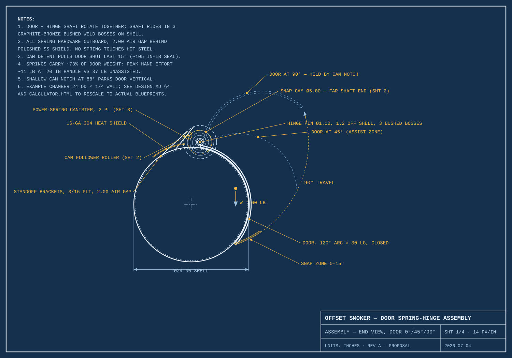

# Offset Smoker — Door Spring-Hinge Assembly

Design proposal for the main cook-chamber doors: a **cam-detent snap-close** combined
with **coiled-ribbon (power spring) lift assist**, with all spring hardware mounted
outboard of the shell behind a heat shield.

Behavior over the 90° door travel:
- **0–15°** — cam detent pulls the door shut with authority and holds it sealed
- **15–88°** — ribbon springs carry ~73% of the door weight (peak hand effort ~11 lb
  instead of 37 lb on the worked example)
- **88–90°** — a shallow second cam notch parks the door vertical

| File | Contents |
|---|---|
| [`docs/DESIGN.md`](docs/DESIGN.md) | Full proposal: concept, torque analysis, component specs, tuning procedure, alternatives comparison |
| [`drawings/`](drawings/) | Blueprint sheets 1–4: assembly end view, snap cam detail, spring canister section, torque-balance chart |
| [`calculator.html`](calculator.html) | Interactive sizing calculator — re-solves springs, cam, and stall check for your actual chamber/door dimensions (works offline) |
| [`tools/generate_drawings.py`](tools/generate_drawings.py) | Generates the SVG sheets from the design parameters |

The worked example assumes a 24" OD × ¼"-wall chamber with a 120° × 30" top-hinged
door; every number is parametric — see `docs/DESIGN.md` §4 or plug real dimensions
into the calculator.

